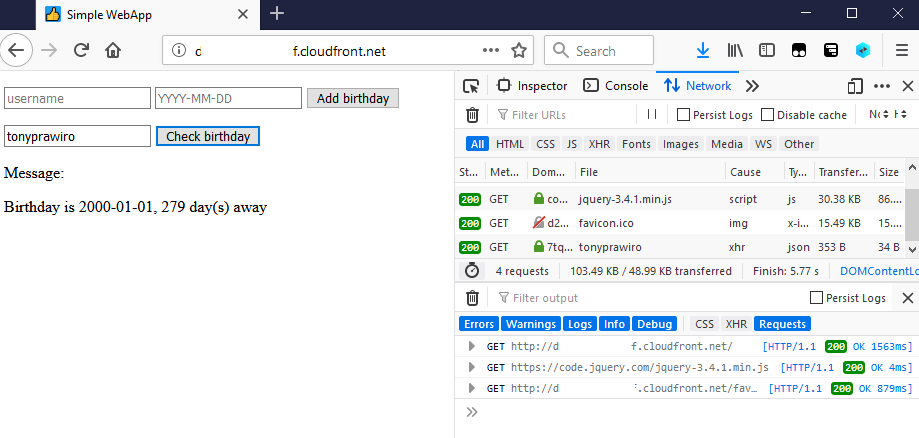

# simple-serverless-webapp

A (very) simple birthday tracker application using serverless services: api gateway, lambda, s3/cloudfront, and dynamodb.

# Architecture


## Security

Simple validation is performed against the request parameters.

(TODO) The application currently doesn't incorporate Authentication and Authorization. Integrating Cognito user pool for simple authentication is in the roadmap.

## Fault Tolerance

The application uses entirely serverless services, such as API Gateway, Lambda, S3, Cloudfront, and DynamoDB. All of these services are Regional services and are automatically deployed across Availability Zones within the region.

## Performance

Amazon Cloudfront and S3 are highly scalable and are able to handle increase of requests without intervention.

Amazon API Gateway, Lambda, and DynamoDB provides mechanisms scale to handle increased requests.

Some ways to tune API Gateway performance:

- API request rate limit (throttling), user-configurable
- Request per second. Default is 10,000 RPS, can be increased via Support case
- Integration timeout, min 50ms, max 29s

Lambda:

- Concurrent executions of 1000 by default, can be increased via Support case
- Provisioned concurrency provides greater control over performance
- Memory up to 3 GB
- Function timeout 15 minutes

DynamoDB:

- Provisioned read and write capacity to ensure level of performance
- No practical limit on table size


## Cost

Singapore region:

- API Gateway pricing is based on number of requests per month, from $4.25/1 million requests
- Lambda pricing is based on number of requests ($0.2 / 1 million), duration ($0.0000166667/GB-second)
- DynamoDB pricing is per WCU ($0.00074 per WCU) and RCU ($0.000148 per RCU), data storage ($0.285/GB/month)
- Cloudfront pricing is based on data transfer out ($0.140/GB), data transfer to Origin ($0.060/GB), and number of HTTP requests ($0.0090/10K requests)
- S3 pricing is based on storage consumed ($0.025/GB/mo) and number of requests ($0.0004/1000 requests)

Based on pricing dimension, the architecture is cost effective for low to reasonably high number of requests.

# Use cases

1. User access the application index.html from the Cloudfront distribution endpoint, which subsequently reaches out to Origin (private S3 bucket) using Origin Access Identity. User is presented with simple HTML page, which is a single page application.


2. User submits a username and day of birth (DOB). Request is passed on to the API endpoint, which is API Gateway resource with Lambda backend. Lambda function parses the request path parameter to get username, parses the request body to get DOB (JSON format), performs validation, and stores record in DynamoDB table. The function returns 204 No content response if record is successfully added.


3. User submits a username to retrieve DOB. Request is sent to the API endpoint, which is also API Gateway resource with Lambda backend. Lambda function parses the request path parameter to get username, performs validation, and make GetItem API to DynamoDB table to fetch the record. The function returns DOB and number of days until next birthday, 200 OK if all is good. The client page displays the info, checks if birthday is today and displays "Happy birthday!" if today is the same day of the year as the DOB.



The API returns 400 Error if input is invalid, and 500 Error for any other errors, along with "status" message.


# Repository content and build step

This repo contains 3 parts: terraform, backend, and spa. Each section is separate build step for the application, they can also be split to different repositories.

For each of the parts, AWS CLI with necessary permission is a prerequisite, such as IAM access key or temporary credentials.

This build steps can be orchestrated in CI/CD platforms such as Jenkins.


## Spa (Single Page Application)

No fancy React/Angular here, but instead the good ol' jQuery :)

Contains the HTML file which is the page that user sees.

The build step is to upload the index.html file and (optionally) perform Cloudfront Invalidation to purge CDN cache. Replace "{{ API_ENDPOINT }}" accordingly.

Example (Powershell):

```
PS D:\Users\tonyhadi\project> ((Get-Content -path index.html -Raw) -replace '{{ API_ENDPOINT }}','https://ABCDEFGHIJ12345.execute-api.ap-southeast-1.amazonaws.com/default/birthday') | Set-Content -Path index.html

PS D:\Users\tonyhadi\project> aws cloudfront create-invalidation --distribution-id EDFDVBD6EXAMPLE --paths "/index.html"
```

## Backend

Contains the Lambda logic for the two functions: get birthday and add birthday. Build step is to package each python file in ZIP format with build number embedded in file name, upload to an S3 bucket, and then perform Lambda update function code with the file in S3 bucket/key.

Example (Powershell script):

```
$build=$args[0]

Compress-Archive -Path getbirthday.py -DestinationPath getbirthday.$build.zip -Force

Compress-Archive -Path addbirthday.py -DestinationPath addbirthday.$build.zip -Force

aws s3 cp getbirthday.$build.zip s3://tonyhadi-simple-serverless-lambda-repo/

aws s3 cp addbirthday.$build.zip s3://tonyhadi-simple-serverless-lambda-repo/
```

## Terraform

Contains infra as code manifest for the entire infrastructure. Build step is "terraform plan" and "terraform apply".

To trigger API Gateway deployment, update the stage variable "api_deployed_at" (example: configure it with current timestamp, or with any dummy value).

To trigger Lambda function update, update the "lambda_code_addbirthday_filename" and "lambda_code_getbirthday_filename" variables with the latest artifact name from the "Backend" part.

The configuration value file, terraform.tfvars, is not checked in to this repo on purpose, for confidentiality.

Example (Powershell):

```
PS D:\Users\tonyhadi\project> terraform plan
...
PS D:\Users\tonyhadi\project> terraform apply
```

